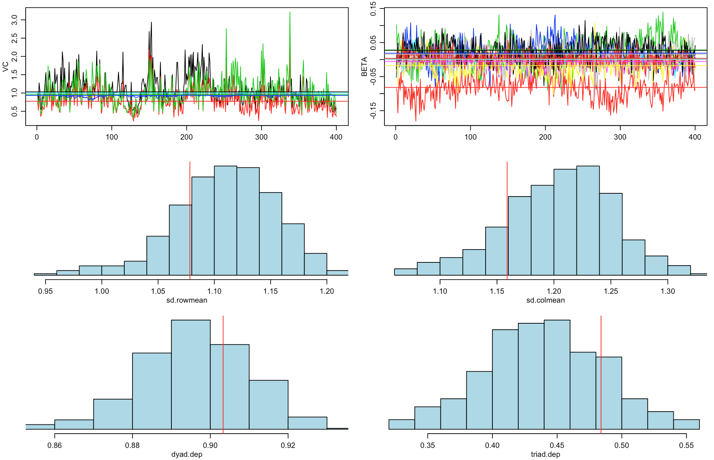
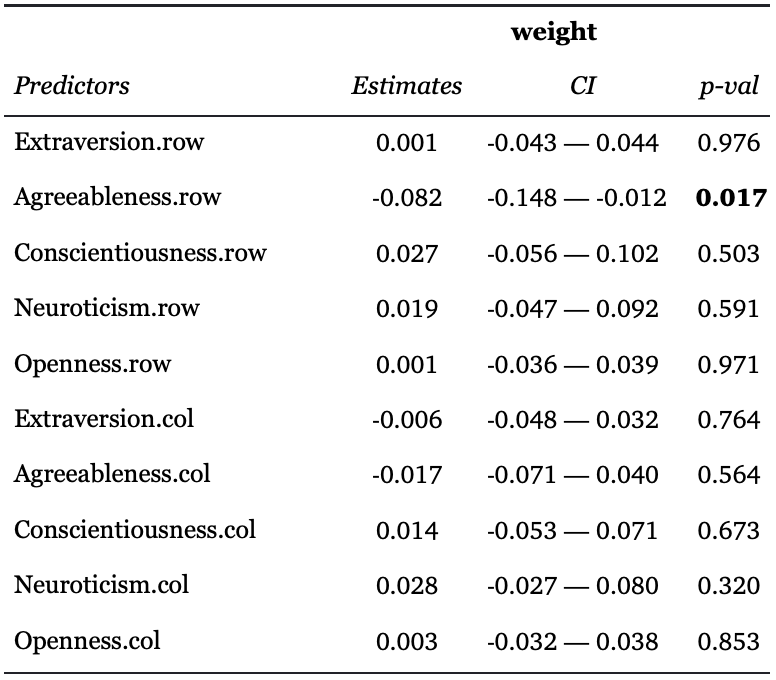
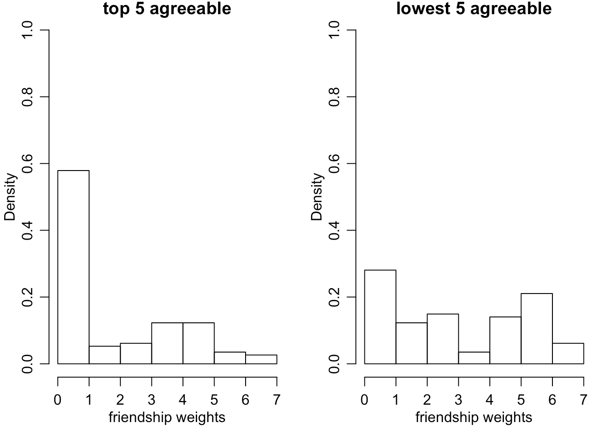
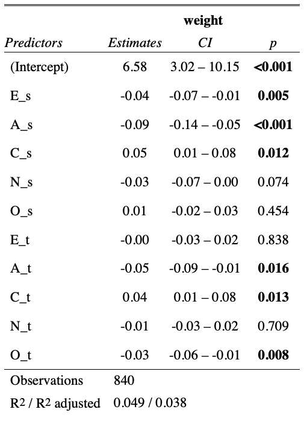

# Inference on Friendship and Personality

<a href="mailto:zhenhua.wang@duke.edu">Zhenhua Wang</a>,   <a href='mailto: sz163@duke.edu'>Sicong Zhao</a>

*MIDS, Duke University*

## 1. Background

This project is inspired by the following question: How do the Big Five personality traits (Openness, Conscientiousness, Extraversion, Agreeableness, Neuroticism) relate to our friendship?

As a result, we have found a significant negative relationship between the friendship rating and the score of the personality trait Agreeableness. 

This finding seems counterintuitive, but after further investigation we realized participants with higher Agreeableness scores are less likely to get familiar with the others, thus leading to the lower average friendship rating.

## 2. Data

The data we used are from MIT (Kim et al, 2009), which captured the personality survey and friendship ratings from 53 participants living in a married graduate student residency of a major US university. We processed the raw data to generate three data tables: *i)* personality traits (Big Five) score of each participant *ii)* friendship rating among subjects *iii)* a table joint by *i)* and *ii)* on subject id. The data table *i), ii)* are used for an additive and multiplicative effect network (AME), and the data table iii) is used in a linear model.

More specifically, the Big Five personality traits are derived by the online version of the 44 questions Big Five questionnaire (John et al, 1999). See table 1 for metrics of Big Five personality traits.

Table 1: Big Five personality traits explained (Staiano et al, 2012)

| Trait                 | Description                        |
| --------------------- | ---------------------------------- |
| **Agreeableness**     | sociable, assertive, playful       |
| **Conscientiousness** | self-disciplined, organized        |
| **Extraversion**      | friendly, cooperative              |
| **Neuroticism**       | calm, unemotional                  |
| **Openness**          | creative, intellectual, insightful |

The friendship rating among subjects table contains surveys from Seb 2010 to May 2011. (Aharony et al, 2011) These surveys were asking each subject (source) to rate a friendship score (weight) with the other subjects (target). So, each subject could be both source and target. The scale of the rating is 0 to 7, where 0 means not familiar at all and 7 means very close. These surveys have been conducted four times during the period, we chose the results from the last survey in order to capture the relative stable and mature relationship status.

For the joint table, as mentioned above, we simply joined the table i) and ii) on subject id.

## 3. Method & Analysis

Given the network structure of our data, the model we considered in this project is the AME model, which is a combination of social relations regression models and multiplicative effects models. (Hoff et al, 2017)

The AME model is given by:

where $m_{i,j} = \beta^Tx_{i,j}, a=(a_1,...,a_n), b=(b_1,...,b_n)$ and $U$and $V$ are $n ⨉ r$ matrices with ith row equal to $u_i$ and $v_i$ respectively, with $r$ being the length of each of these latent vectors . $x_{i,j}$ is a p-dimensional vector of regressors and $\beta$ is a vector of regression coefficients to be estimated. The vector $x_{i,j}$ may contain variables that are specific to nodes or pairs of nodes. For example, it could contain sender specific characteristics or receiver specific characteristics, dyadic specific characteristics. $a_i$ and $b_j$ are two additive effects, row effect and column effect. Finally, AME also contains a noise matrix E. (Hoff et al, 2017)

To train the AME model, we created a weighted friendship adjacency matrix from the table ii) by pivot. In the newly created adjacency matrix, each entry $y_{i,j}$ denotes the value of the relationship between source $i$ and target $j$.

After training the AME model, we then check how well it fits our friendship network (friendship adjacency matrix). According to the goodness-of-fit plot (plot1), there is no significant discrepancy, and the observed values and posterior predictive values of four goodness-of-fit statistics (the empirical standard deviation of the row means, the empirical standard deviation of the column means, the empirical within-dyad correlation, a normalized measure of triadic dependence) agree with each other. 

Plot 1: Goodness-of-fit for AME model

Then, we interpret our model by examining the coefficients of AME. The only significant coefficient is the “Agreeableness.row”, which indicates a negative correlation between Agreeableness and friendship score. Confidence interval also confirms the same result. 

This result seems somewhat counterintuitive, so we further explored our data by comparing the distribution of friendship weights of 5 people with highest agreeableness scores and 5 people with lowest agreeableness scores (plot 2). As suggested in the plot 2, people with highest agreeableness scores have higher density on friendship weight equals to 0, which means they are less likely to get familiar with the others.

Table 2: Summary of AME model

Plot 2: Comparison of friendship weights between the top 5 agreeable people and the lowest 5 ones

To cross validate the result of the AME model, we then conducted a linear regression analysis. The features of the linear model are the five personality traits of the source and target of each friendship rating record, and the rating itself. 

The result of the linear model is shown in table 3. As we can see, the agreeableness also shows the most significant negative relationship with the target variable among all predictors. This result supports the finding of the AME model.

Table 3. Linear Model Summary.

In table 2, the predictors name rules are that 'E', 'A', 'C', 'N', 'O' stands for Extraversion, Agreeableness, Conscientiousness, Neuroticism, Openness. Suffix 's' stands for source, 't' stands for target. 'weight' is the name of friendship evaluation score.

## 4. Conclusion

In this project, we studied the relationship between the Big Five personality traits and friendship attributes. Through the analysis of AME model and linear regression, we have found significant negative correlation between the personality trait agreeableness and friendship rating (weight). To verify this seemingly counterintuitive result, we further visualized the density distribution of friendship weights of people with highest and lowest agreeableness scores. Through the comparison, we have recognized that people with highest agreeableness scores have higher density on friendship weight equals to 0, which means they are less likely to get familiar with the others. 

In our perspective, there are two limitations of this study. First, the amount of data is limited, with 35% missing values. Second, since this is an observational study, we could not claim causal relationships.

For the next steps, we are going to utilize the multiple surveys across times from this longitudinal study to unveil the relationship between the Big Five personality traits and the dynamics of friendship.

## *Reference*

*Aharony, N., Pan, W., Ip, C., Khayal, I., & Pentland, A. (2011). Social fMRI: Investigating and shaping social mechanisms in the real world. Pervasive and Mobile Computing, 7(6), 643-659.*

*Hoff, P. D. (2015). Dyadic data analysis with amen. arXiv preprint arXiv:1506.08237.*

*John, O. P., Naumann, L. P., & Soto, C. J. (2008). Paradigm shift to the integrative big five trait taxonomy. Handbook of personality: Theory and research, 3(2), 114-158.*

*Olguín, D. O., Waber, B. N., Kim, T., Mohan, A., Ara, K., & Pentland, A. (2008). Sensible organizations: Technology and methodology for automatically measuring organizational behavior. IEEE Transactions on Systems, Man, and Cybernetics, Part B (Cybernetics), 39(1), 43-55.*

*Wikipedia contributors. (2020, May 24). Big Five personality traits. In Wikipedia, The Free Encyclopedia. Retrieved 04:33, May 25, 2020, from https://en.wikipedia.org/w/index.php?title=Big_Five_personality_traits&oldid=958570699*

